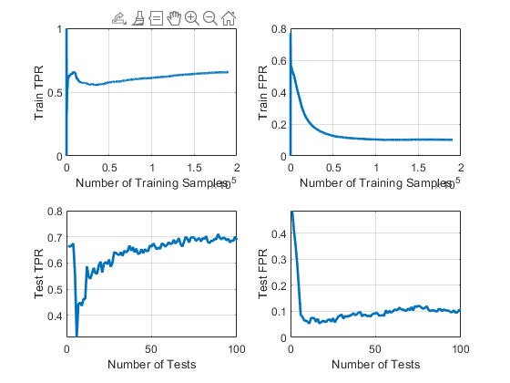

# Context Tree Based Online Nonlinear Neyman-Pearson Classification
This is the repository for context tree based Video NP Tree algorithm.
This implementation also contains cross-validation of the hyper-parameters. Best set of hyper-parameters are selected based on NP-score with grid search. 

# Space Partitioning
Coordinate partitioning

# Evaluating and Using the results
Running the model will generate 4 different graphs. 
These graphs correspond to transient behaviour of the model during training. 
In order to look at the final results, use the latest element of each array for the corresponding metric. 
Graphs of the 4 different arrays are shown below. 
 

Top and bottom figures are related to train and test, respectively. The number of samples in training is related to the augmentation (explained in model parameters). 
In current case, the number of training samples is ~150k. Similarly, for test figures, there are 100 data points, where each point is an individual test of the existing 
model at different stages of the training. Please refer to the paper for more detailed explanation. 

Thanks!
Basarbatu Can